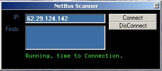



## Trojan Scanner

### Description

Scan NetBus Server in your Computer or If you want scan your friends computer. Easy to coding. But it's very good code.
 
### More Info
 

             |
---                |---
**Submitted On**   |2001-09-15 15:10:40
**By**             |[Yigit Aktan](https://github.com/Planet-Source-Code/PSCIndex/blob/master/ByAuthor/yigit-aktan.md)
**Level**          |Beginner
**User Rating**    |4.7 (14 globes from 3 users)
**Compatibility**  |VB 6\.0
**Category**       |[Coding Standards](https://github.com/Planet-Source-Code/PSCIndex/blob/master/ByCategory/coding-standards__1-43.md)
**World**          |[Visual Basic](https://github.com/Planet-Source-Code/PSCIndex/blob/master/ByWorld/visual-basic.md)
**Archive File**   |[Trojan Sca264649152001\.zip](https://github.com/Planet-Source-Code/yigit-aktan-trojan-scanner__1-27253/archive/master.zip)

